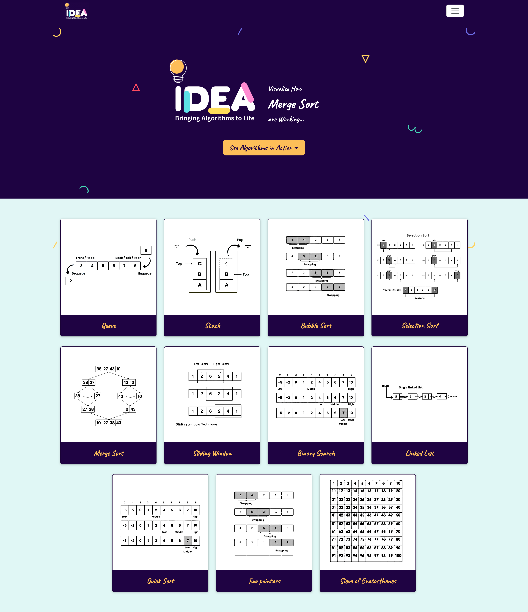
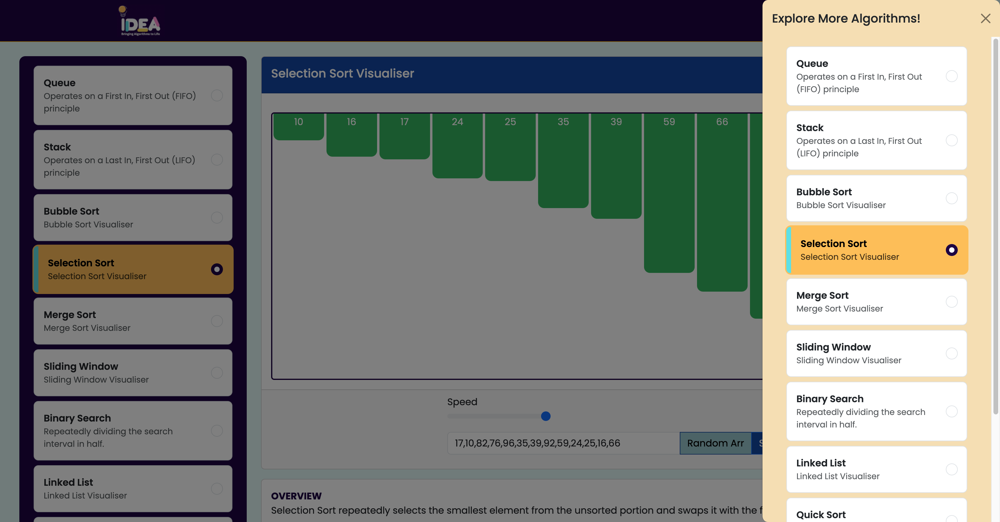

# Algorithm Visualizer

## Introduction
The Algorithm Visualizer is a web-based tool designed to help users understand and visualize the workings of various algorithms and data structures. Through interactive animations, it demystifies complex concepts and aids in learning and teaching algorithms.

## Project Type
Frontend

## Deployed App
- [Live Demo on Netlify](https://algorithammvisualizerrr.netlify.app/)

## Directory Structure
<pre>
 CW-Twitter-Trailblazers_099/
 ├─ algorithm/
 ├─ assets/
 │ ├─ css/
 │ ├─ image/
 │ ├─ js/
 ├─ index.html
 ├─ Various HTML files
 ├─ README.md
</pre>


## Video Walkthrough of the Project
- [Project Features Walkthrough (7 minutes)](https://youtu.be/vz9fANqD3wM?si=qrszzbcUW2hTZ27N)

## Video Walkthrough of the Codebase
- [Codebase Walkthrough (6 minutes)](https://drive.google.com/file/d/1Xt69tNkWxR--V6XBEHyUVEngScYumLSP/view?usp=sharing)


## Features

- **Algorithm Visualization**: Watch sorting algorithms visually step through their operations.
- **Interactive Interface**: Easily adjust parameters and input data to see algorithmic changes in real-time.
- **Multiple Algorithms**: Choose from a variety of sorting algorithms such as
  - Quick Sort
  - Merge Sort
  - Bubble Sort
  - Selection Sort
  - Linked List
  - Stack
  - Queue
  - Binary Search
  - Sliding Window
  - Sieve of Eratosthenes
- **Customizable Speed**: Control the speed of visualization to observe algorithms at different rates.
- **Clear Visualization**: Visual representation of data structures and algorithmic processes.
- **Responsive Design**: Ensures compatibility and usability across different devices and screen sizes.
- **No Authentication Required**: Immediate access and usage without the need for authentication.


## Design Decisions and Assumptions
- **JavaScript for Algorithm Implementation:** Ensures compatibility and ease of use.
- **Interactive UI:** Built with HTML, CSS, and JavaScript for a seamless user experience.
- **Minimalistic Design:** Focuses on clarity and user engagement.

## Installation & Getting Started
To set up and run the project locally:

1. Clone the repository:
   ```bash
   git clone https://github.com/plpatil1/CW-Twitter-Trailblazers_099.git

2. Navigate to the project directory:
   ```bash
   cd CW-Twitter-Trailblazers_099

## Usage
Open index.html in your web browser to start the visualizer.

## Credentials
No authentication is required for this application.

## APIs Used
No external APIs are utilized in this project.

## Technology Stack

### Core Technologies
- **HTML**: Provides the structure of the web pages.
- **CSS**: Stylesheets for visual styling and layout.
- **JavaScript**: Adds interactivity and dynamic behavior to the visualizations.

### Libraries and Frameworks
- **Bootstrap**: CSS framework for responsive and mobile-first design. [Bootstrap](https://getbootstrap.com/)
- **D3.js (Data-Driven Documents)**: JavaScript library for manipulating documents based on data. [D3.js](https://d3js.org/)
- **Animate.css**: CSS library for animations. [Animate.css](https://animate.style/)

### Usage

For the Algorithm Visualizer project, the primary technologies used include HTML, CSS, and JavaScript for creating the foundational structure, styling, and interactivity of the visualizations. These are complemented by Bootstrap for responsive design, D3.js for data-driven manipulation of visuals, and Animate.css for adding dynamic animations.


## Screenshots




